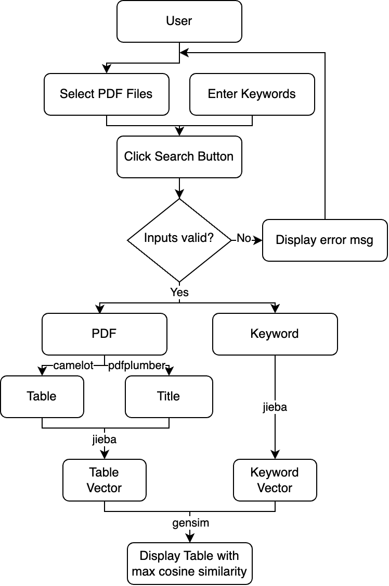

# Stage-A Document Intelligence

## Installation

```bash
conda create -n docint python=3.11
conda activate docint
conda install -c conda-forge ghostscript
pip install -r requirements.txt
```

## Usage

To start the Streamlit web app, run the following command in your terminal:

```bash
streamlit run main.py
```

Once the app is running, follow these steps:
1. **Select PDF Files**: Use the provided interface to select one or more PDF files.
2. **Enter Keywords**: Input the keywords you want to search for in the PDF documents.
3. **Search**: Click the 'Search' button to find tables and texts that match your keywords.


## Flow chart



## Test Document

[Document 1](https://docs.google.com/document/d/1Di5oVYhUF6p-zj2y0DEBBeTvhC91KhX8/edit?usp=sharing&ouid=107784913306655694785&rtpof=true&sd=true)
[Document 2](https://docs.google.com/document/d/1HiZrgIyvwY8Fi4eLS0QGUkkycngtD6XJ/edit?usp=sharing&ouid=107784913306655694785&rtpof=true&sd=true)