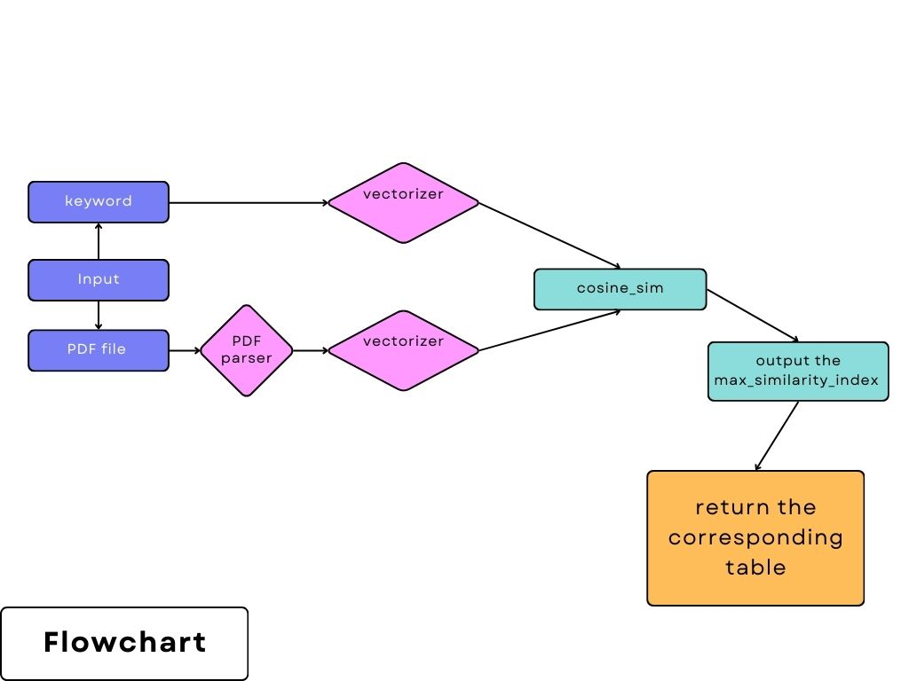

# Stage-A Document Intelligence

## Installation

```bash
pip install -r requirements.txt
```

#### How to run my code 
```bash
python3 main.py <keyword>  <The path to the PDF file>
# example : python3 main.py 非監督式學習的應用 docs/1.pdf  
```
#### Problems ?
add `--help` arg for command help 
```bash
python3 main.py --help
```

#### Expected output
```
Similarity scores: [...]
Most relevant table:
... below is the hole table with desired information in it...
```

#### Flow chart 
