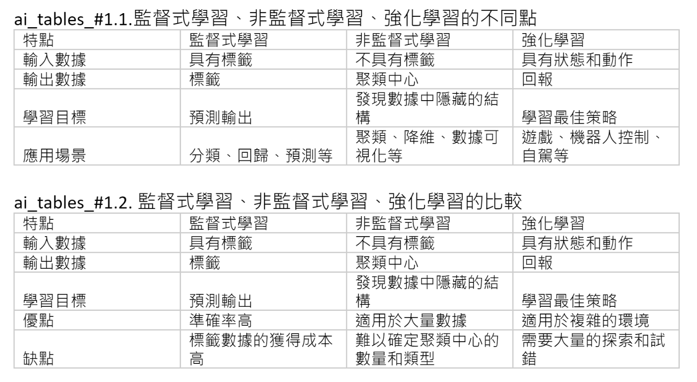
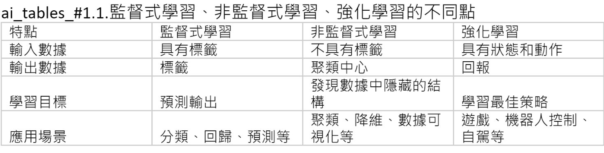
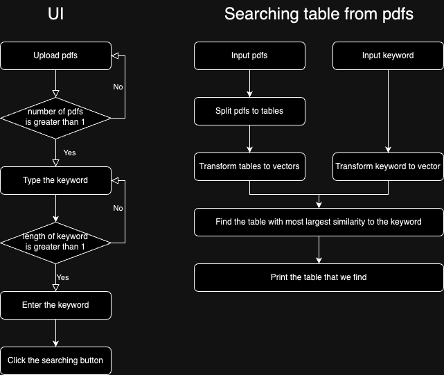
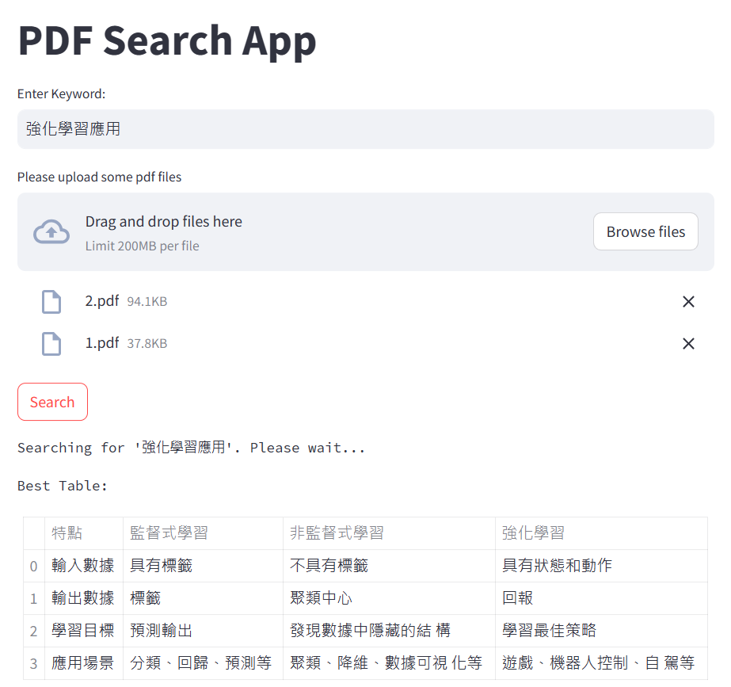

# Stage-A Document Intelligence

## Installation

```bash
conda create -n docint python=3.11
conda activate docint
conda install -c conda-forge ghostscript
pip install -r requirements.txt
```

## Target
&nbsp;&nbsp;&nbsp;&nbsp;&nbsp;&nbsp;&nbsp;
Create an artificial intelligence that searches in which table in the given pdf files has the desired information.  

## Run
```python
streamlit run main.py
```

## Input

1. pdf files with only tables inside
2. the searching keywords

## Output
&emsp;&emsp;
the hole table with desired information in it


## Example

The given pdf file:  


Search query :  

```commandline
非監督式學習的應用
```

Output:



## Flow Chart



## Demo


## Background Knowledge

[Azure Document Intelligence]( https://azure.microsoft.com/en-us/products/ai-services/ai-document-intelligence
)

## Test Document

[Document 1](https://docs.google.com/document/d/1Di5oVYhUF6p-zj2y0DEBBeTvhC91KhX8/edit?usp=sharing&ouid=107784913306655694785&rtpof=true&sd=true)
[Document 2](https://docs.google.com/document/d/1HiZrgIyvwY8Fi4eLS0QGUkkycngtD6XJ/edit?usp=sharing&ouid=107784913306655694785&rtpof=true&sd=true)
