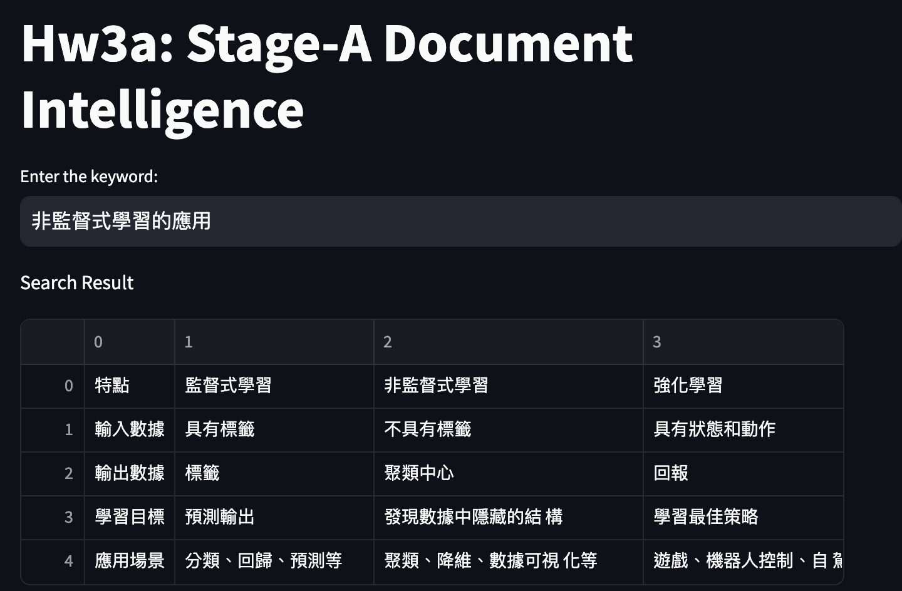

# Stage-A Document Intelligence
資工所碩二 r11922090 林則仰 branch:85

## Installation

```bash
conda create -n docint python=3.11
conda activate docint
conda install -c conda-forge ghostscript
pip install -r requirements.txt
```

## How to run the code
```
streamlit run main.py [path of pdf file]
```

## Target

Create an artificial intelligence that searches in which table in the given pdf files has the desired information.  

#### Input

1. pdf files with only tables inside
2. the searching keywords

#### Output

**the hole table with desired information in it**

#### Example

The given pdf file:  

Search query:  

```commandline
非監督式學習的應用
```

Output:


#### Flow Diagram


#### Demo
