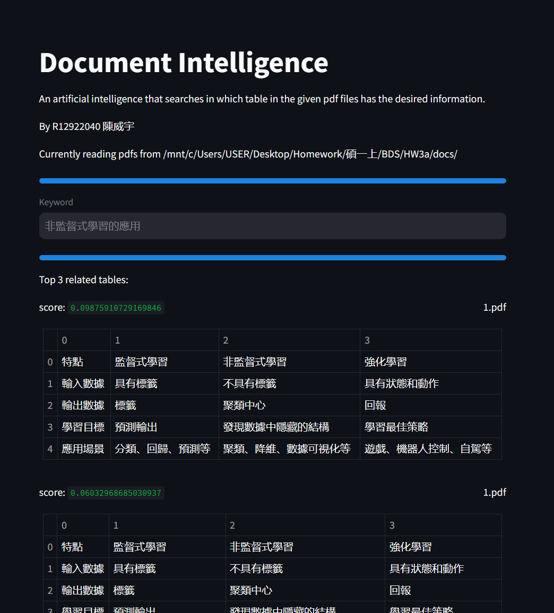

# Stage-A Document Intelligence

# PDF搜尋工具

這是一個使用 Python 和 Tkinter 建立的桌面應用程式，可讓用戶上傳 PDF 文件，搜索包含特定關鍵字的表格，並將結果顯示在用戶介面中。

## 功能

- **上傳 PDF**: 允許用戶上傳包含表格的 PDF 文件。
- **關鍵字搜尋**: 用戶可以輸入一個關鍵字，應用程式會搜尋 PDF 文件中最相關的表格。
- **結果展示**: 將最匹配的表格以表格形式顯示在應用程式中。
- **儲存結果**: 允許用戶將搜尋到的表格保存為 CSV 文件。

## 使用方法

1. 啟動程式後，點擊 "上傳PDF文件" 按鈕選擇你的 PDF 文件。
2. 在 "輸入關鍵字" 欄位中，輸入你想要搜尋的關鍵字。
3. 點擊 "搜尋" 按鈕開始搜尋過程。
4. 搜尋結果將在下方的表格視窗中展示。
5. 若需要，你可以通過點擊 "儲存結果" 按鈕來保存搜尋結果。




## 安裝需求

確保你的系統中已安裝以下 Python 庫：

- tkinter
- pandas
- camelot-py
- scikit-learn

你可以使用 `pip` 來安裝所需的庫：

```bash
pip install tkinter pandas camelot-py scikit-learn
```

## 啟動程式

在終端中運行以下命令來啟動應用程式：

```bash
python main.py
```