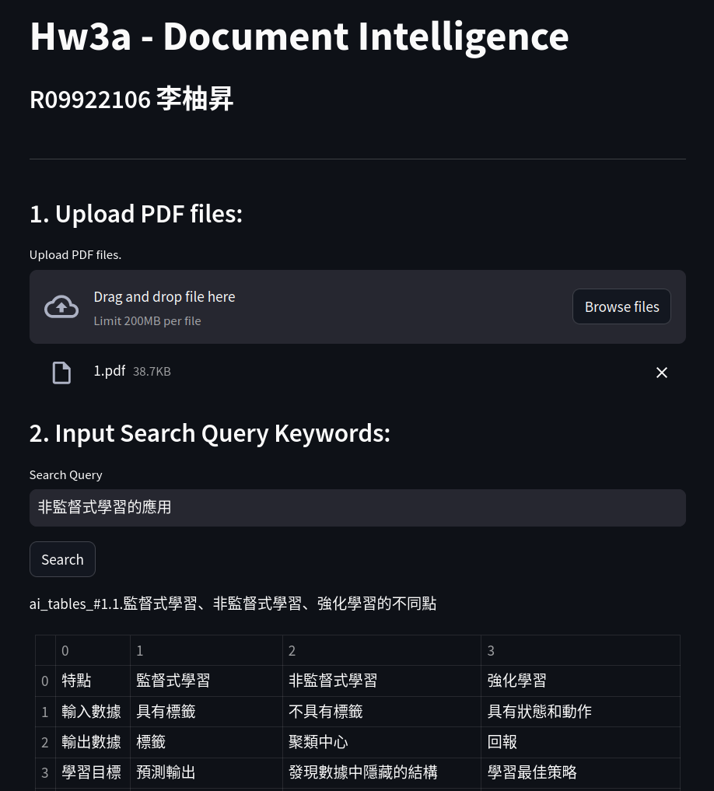
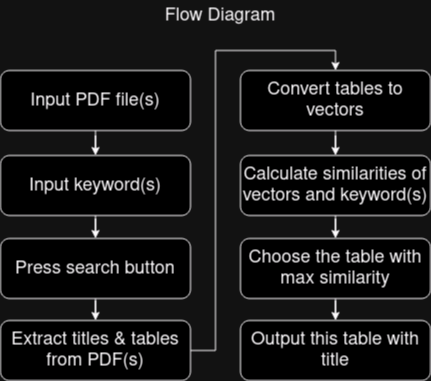

# Hw3a - Document Intelligence
## Author
R09922106 李柚昇 

## Installation

```bash
conda create -n docint python=3.11
conda activate docint
conda install -c conda-forge ghostscript
pip install -r requirements.txt
```

## Usage
```bash
streamlit run main.py
```

## Sample Screenshot


## Flow Diagram


## Target

Create an artificial intelligence that searches in which table in the given pdf files has the desired information.  

#### Input

1. pdf files with only tables inside
2. the searching keywords

#### Output

**the whole table with desired information in it**

#### Example

The given pdf file:  

Search query:  

```commandline
非監督式學習的應用
```

Output:


## How to contribute

* Every one finishes the whole project and pulls the requests , do not edit the main branch
* if your code is acceptable, we will add it into the main branch

## Note

* In hw3a, you can use any package you think would be helpful.
* It's also necessary to implement the UI.
* Also using draw io to draw a flow diagram is required.

## Background Knowledge

[Azure Document Intelligence](https://azure.microsoft.com/en-us/products/ai-services/ai-document-intelligence
)

## Test Document

[Document 1](docs/1.pdf)
[Document 2](docs/2.pdf)
