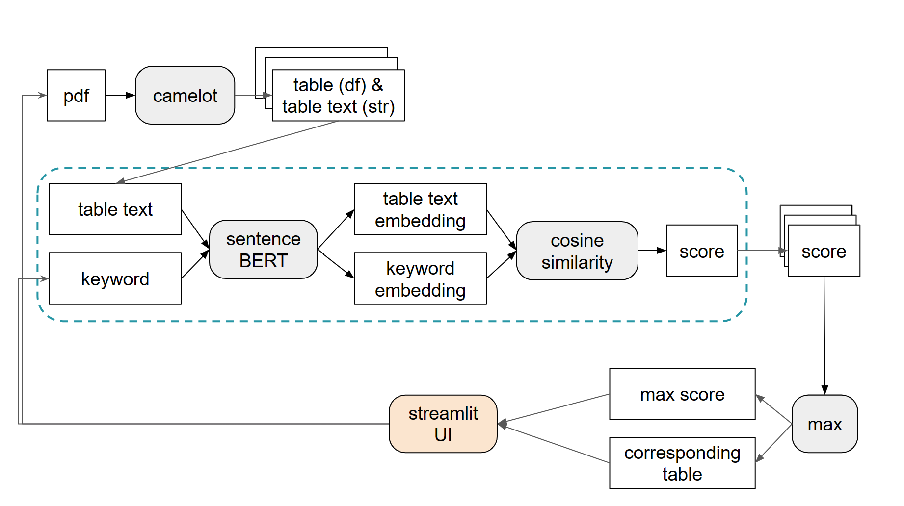

# Stage-A Document Intelligence
Author: Ting-Wen Ko



## How to Run This Repo
### Installation
```bash
conda create -n docint python=3.11
conda activate docint
conda install -c conda-forge ghostscript
pip install -r requirements.txt
```

### Run
Run the UI interface.
```
streamlit run app.py
```
Then, you should see streamlit output in cmd like below. Click the `Network URL` and you can start playing! :tada:

```
  You can now view your Streamlit app in your browser.

  Network URL: http://<ip_address><port>
  External URL: http://<ip_address><port>
```

## Instruction By TA
### Installation

```bash
conda create -n docint python=3.11
conda activate docint
conda install -c conda-forge ghostscript
pip install -r requirements.txt
```

### Target

Create an artificial intelligence that searches in which table in the given pdf files has the desired information.  

##### Input

1. pdf files with only tables inside
2. the searching keywords

##### Output

**the hole table with desired information in it**

##### Example

The given pdf file:  

Search query:  

```commandline
非監督式學習的應用
```

Output:


### How to contribute

* Every one finishes the whole project and pulls the requests , do not edit the main branch
* if your code is acceptable, we will add it into the main branch

### Note

* In hw3a, you can use any package you think would be helpful.
* It's also necessary to implement the UI.
* Also using draw io to draw a flow diagram is required.

### Background Knowledge

[Azure Document Intelligence]( https://azure.microsoft.com/en-us/products/ai-services/ai-document-intelligence
)

### Test Document

[Document 1](https://docs.google.com/document/d/1Di5oVYhUF6p-zj2y0DEBBeTvhC91KhX8/edit?usp=sharing&ouid=107784913306655694785&rtpof=true&sd=true)
[Document 2](https://docs.google.com/document/d/1HiZrgIyvwY8Fi4eLS0QGUkkycngtD6XJ/edit?usp=sharing&ouid=107784913306655694785&rtpof=true&sd=true)
